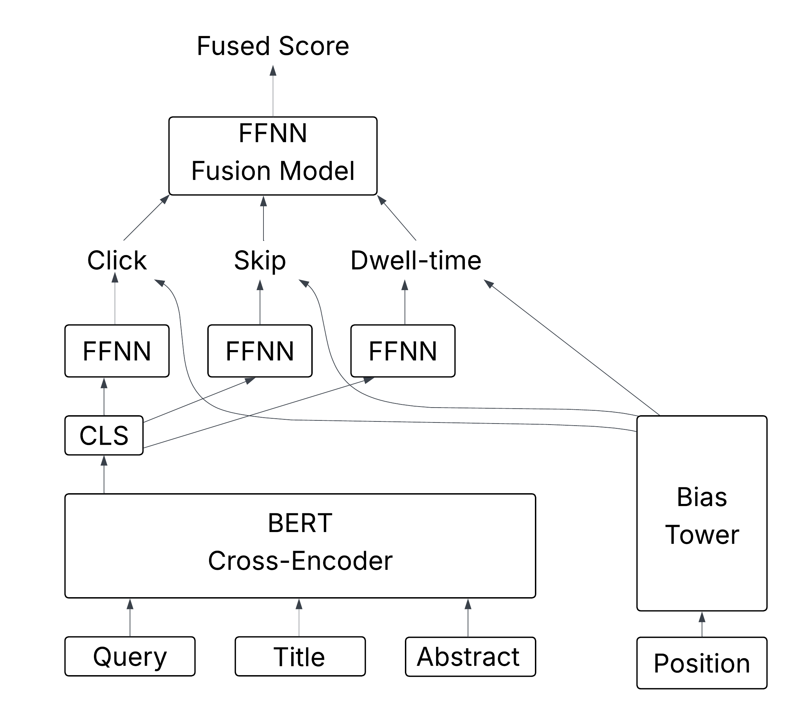

# Multi-Task Learning for Unbiased Learning-to-Rank on Baidu-ULTR

This repository contains the code used in our study on **multi-task learning for unbiased learning-to-rank** using multiple user feedback signals on the **Baidu-ULTR** dataset.

The goal of this work is to investigate whether jointly modeling heterogeneous user feedback (clicks, skips, and dwell time) improves the effectiveness of transformer-based cross-encoder ranking models trained from implicit feedback.

This repository is released **anonymously** to support reproducibility during peer review.

---

## Overview

The proposed approach builds on a **BERT-based cross-encoder** architecture and extends it with a **multi-task learning framework**:

- A **relevance tower** jointly learns from multiple user feedback signals:
  - Click
  - Skip
  - Dwell time
- A **bias tower** models position-dependent biases using rank position as input
- A **fusion mechanism** combines task-specific relevance signals into a final ranking score

An overview of the architecture is shown below:



---

## Dataset

This work uses the **Baidu-ULTR** dataset introduced by Zou et al. (2022), A Large Scale Search Dataset for Unbiased Learning to Rank.

The dataset consists of:
- Large-scale search sessions with implicit user feedback
- A separate expert-annotated relevance dataset used for evaluation

Due to licensing and size constraints, the dataset itself is **not included** in this repository.  
Please refer to the original Baidu-ULTR publication for access instructions.

---

## Repository Structure

```text
.
├── README.md
├── environment.yml
├── images/
│   └── model-architecture-multi-task-bert.png
├── src/
│   ├── data.py                  # Dataset loading and preprocessing
│   ├── model.py                 # Cross-encoder and multi-task model definitions
│   ├── train_ddp.py             # Distributed pre-training script
│   ├── multi_task_fuse.py       # Multi-task fusion training
│   ├── evaluate.py              # Evaluation on expert-labeled data
│   ├── bias_estimation.py       # Position bias statistics
│   └── ranking_metrics.py       # Ranking metrics
├── utils/
│   ├── ultr_feedback_stats.json # Aggregated feedback statistics
│   ├── *.csv                    # Logged loss curves and evaluation scores
└── *.sh                         # Example training and evaluation scripts
```

## Environment Setup

We recommend using **Mamba** (or Conda) to create the environment:

```bash
mamba env create --file environment.yml
```

## Training

Pre-training with Multi-Task Objectives

To pre-train the cross-encoder with multiple feedback signals:
```bash
sbatch pretrain.sh
```

This script trains the relevance and bias towers jointly using click, skip, and dwell-time supervision.

## Fusion Training

To train the fusion layer that combines task-specific relevance scores:
```bash
sbatch multi-task-fuse.sh
```

## Evaluation

Evaluation is performed on the expert-labeled Baidu-ULTR test set:
```bash
sbatch eval.sh
```

## Model Checkpoints

Due to size constraints, trained model checkpoints are not included in this repository.

All experiments in the paper can be reproduced by running the provided training scripts with the Baidu-ULTR dataset.
The visualization and analysis scripts that depend on trained checkpoints will raise a clear error if no checkpoint is provided.

## Reproducibility Notes

All hyperparameters are explicitly specified in the scripts and configuration files.

## Notes on Anonymity

This repository is released for anonymous peer review.
All identifiers, paths, and metadata that could reveal author identity have been removed.

## Citation

If you use or build upon this code, please cite the corresponding paper (citation to be added upon publication).
